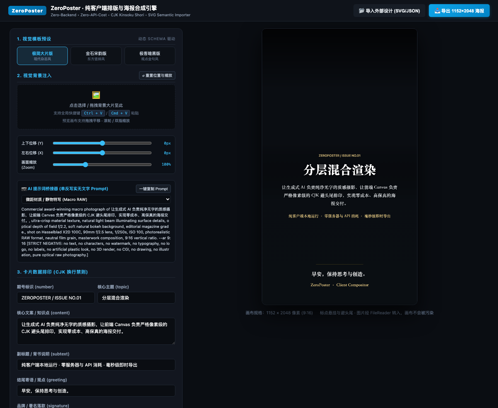
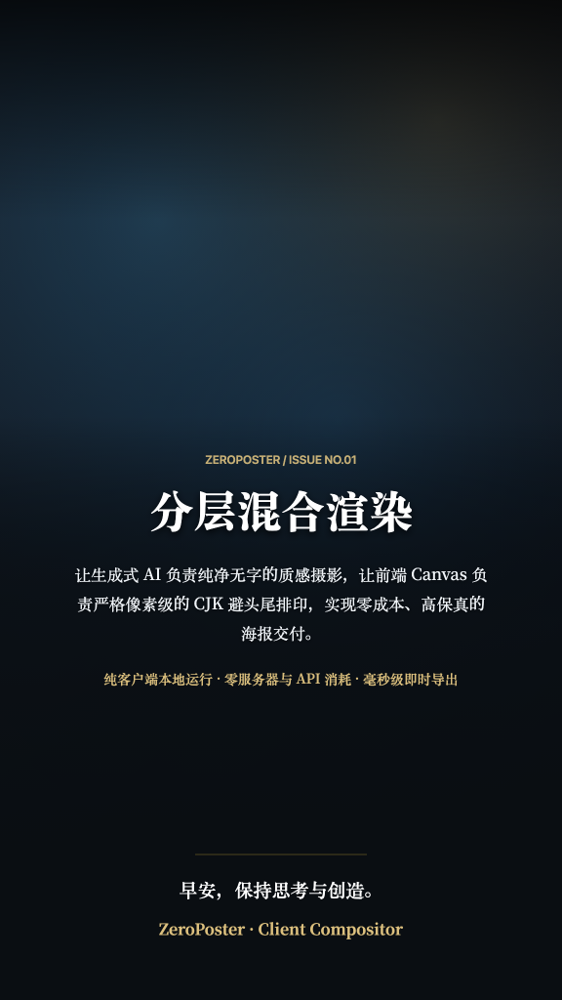
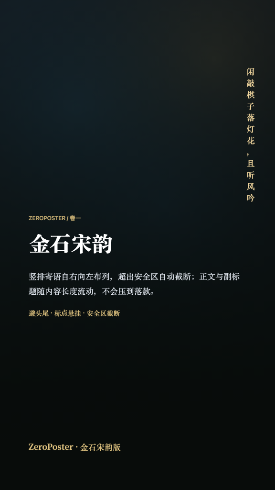
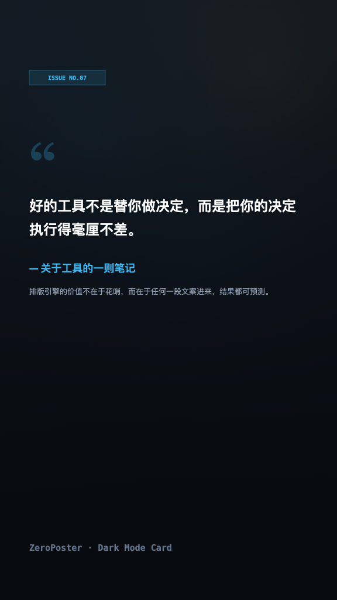

# ZeroPoster

> 零后端、零 API 成本的纯客户端海报排版与合成引擎，内置 CJK 换行禁则排印。
> Zero-backend, zero-API-cost, client-side poster engine with CJK Kinsoku Shori typography.

[](https://github.com/ixiangqun/ZeroPoster/actions/workflows/ci.yml)
[](LICENSE)



---

## 一、解决什么问题

用 AI 直接生成带文字的海报，文字往往畸变、错字、标点乱跳，达不到商用排版要求。
人工逐张排版成本高。传统在线设计工具则依赖服务端无头浏览器截图或付费 API。

ZeroPoster 把这件事拆成两半：

- **AI 只负责出图**：生成纯净无字的写实材质底图（内置提示词生成器，带强负向无字约束）。
- **浏览器负责排字**：在本地 Canvas 上执行 CJK 换行禁则、标点悬挂、竖排与安全区截断。

底图经 `FileReader` 转成 data URL 后进入画布，因此不会触发跨域污染，导出始终可用。
整个过程没有服务器、没有 API 调用、没有构建步骤。

---

## 二、快速开始

**直接运行**——双击 `index.html`，用任意现代浏览器打开即可。不需要 Node.js，不需要 `npm install`，不需要本地服务器。

> 内置模板被编译进 `core/Presets.js` 并以 `<script>` 引入，正是为了让 `file://` 直接可用：
> 浏览器会以 CORS 错误拒绝 `file://` 下的 `fetch()`。

需要 `http://` 环境时（例如调试剪贴板 API）：

```bash
npm run serve
```

---

## 三、内置模板

| 极简大片版 | 金石宋韵版 | 极客暗黑版 |
|---|---|---|
|  |  |  |
| 现代杂志风 | 东方竖排风 | 观点金句风 |

> 示例图中的背景为程序生成的抽象渐变，用于演示「底图 + 排印」的合成效果，非真实照片。

---

## 四、排版引擎做了什么

### 换行禁则（Kinsoku Shori）

行首禁则字符（`，。！？、；：）》」…` 等）在断行时**悬挂**到上一行行尾；
行尾禁则字符（`（《「“` 等）整体**推入**下一行。连续的禁则标点（如 `。」`）会一并处理。

依据 W3C《中文排版需求》(CLREQ) 与 JIS X 4051。

> 说明：GB/T 15834 是《标点符号用法》，规范的是标点的**用法**而非换行算法，
> 因此本项目只在「半角标点归一化」环节参考它，不把它当作禁则依据。

### 上下文感知的标点归一化

半角标点只在**紧邻中日韩文字**时才转全角，因此以下内容不会被破坏：

| 输入 | 输出 |
|---|---|
| `访问 https://a.com/x?id=1, 售价 1,000 元` | `访问 https://a.com/x?id=1，售价 1,000 元` |
| `时间 3:30`、`画幅 16:9` | 原样保留 |
| `hello, world!` | 原样保留 |
| `联系 hello@example.com` | 原样保留 |

### 西文单词不被拆断

排版单元按「URL / 邮箱 → 整体」「连续西文单词 → 整体」「单个汉字 → 独立」切分，
`Canvas` 不会被断成 `Canva` + `s`。只有单词本身宽于整行时才退化为逐字符断开。

### 流式布局与安全区

这是模板不会互相压盖的关键。

- 图层默认使用自身的绝对 `y`。
- 标记 `"flow": true` 的图层，`y` = 上一个图层的实际底部 + `flowGap`，因此文案变长时后续图层被整体推下去。
- `maxBottomY` 是硬边界：横排换算为最大行数、竖排限制列高，**超出一律截断并追加省略号，而不是画出边界**。

竖排文本自右向左布列，列数默认按安全区所需的最少列数自动计算（也可用 `columns` 显式指定）。

---

## 五、工程模块

| 路径 | 说明 |
|---|---|
| `core/KinsokuEngine.js` | 换行禁则、标点归一化、横排与竖排布局。不依赖 DOM，可直接单测。 |
| `core/CanvasCompositor.js` | 图层合成、拖拽/滚轮/双指手势、锚点缩放、本地导出。 |
| `core/DesignImporter.js` | SVG 语义插槽解析、JSON 模板校验与流式布局渲染。 |
| `core/PromptBridge.js` | AI 摄影提示词生成器（6 种场景模态，带负向无字约束）。 |
| `core/Presets.js` | **自动生成**，勿手改。由 `templates/*.json` 编译而来。 |
| `schemas/template.schema.json` | 模板协议。运行时等价校验在 `DesignImporter.validateTemplate()`，两者由测试断言保持一致。 |
| `tools/build-presets.mjs` | 模板编译器。 |
| `tools/serve.mjs` | 零依赖本地静态服务器（可选）。 |

---

## 六、外部设计导入

### 方式 A：SVG 语义插槽

1. 在 Figma / Illustrator / Sketch 中完成设计。
2. 把需要动态替换的文本图层 ID 命名为 `field_number`、`field_topic`、`field_content`、`field_subtext`、`field_greeting`、`field_signature`（或用 `data-field="topic"`）。
3. 导出标准 `.svg`，在界面点击「导入外部设计」。

导入后**继续编辑文案仍然生效**——引擎会重新插槽并栅格化（带防抖）。
参考 `sample-design.svg`。

### 方式 B：JSON 模板协议

编写符合 `schemas/template.schema.json` 的 JSON 并导入。校验失败时会明确指出是哪一个图层的哪一个字段有问题。

修改内置模板后需要重新编译：

```bash
npm run build:presets
```

---

## 七、开发

```bash
npm test            # 运行全部单元测试（零依赖，用 node:test）
npm run verify      # 校验 Presets 与模板同步 + 跑测试
npm run build:presets
```

测试覆盖：换行禁则不变量（行首/行尾/空行/超宽）、标点归一化的破坏性回归、
竖排安全区边界、模板图层压盖回归、缩放锚点数学、源码卫生（裸控制字符）。

详见 [CONTRIBUTING.md](CONTRIBUTING.md)。

---

## 八、已知限制

诚实地说明边界，避免误用：

- **导出为 1152 × 2048 像素（9:16）**，这是社交媒体尺寸，不是印刷尺寸。按 300 DPI 折算约 3.8 × 6.8 英寸，不足 A5。需要印刷请自行调整 `dimensions` 并使用矢量流程。
- **竖排标点位置未做旋转与偏移**。严格的竖排中文排版里 `，。` 应位于字面框右上角，目前直接居中绘制。
- **Web 字体是可选增强**。`Noto Serif SC` 从 Google Fonts 非阻塞加载；离线或 CDN 不可达时自动回落到系统思源宋体 / 宋体，排版结构不受影响，但字形观感会有差异。
- **SVG 导入模式下不做换行与安全区处理**。SVG 的 `<text>` 节点本身不会自动换行，
  引擎只做插槽替换，排版完全由设计稿决定，过长的文案会溢出画面。
  需要自动换行与压盖保护请使用 JSON 模板模式。
- **SVG 导入依赖浏览器栅格化**，若 SVG 引用了外部资源或未内嵌字体，可能渲染失败或字体回退。
- **未做撤销/重做与多图层编辑**，定位是「结构化数据 + 模板」而不是通用设计器。

---

## 九、许可证

[MIT](LICENSE)。商业使用友好。
